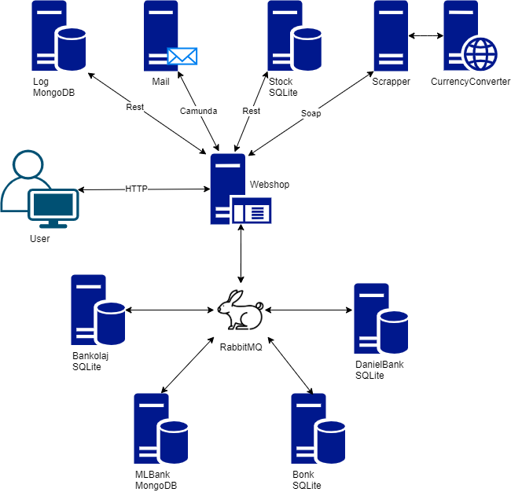
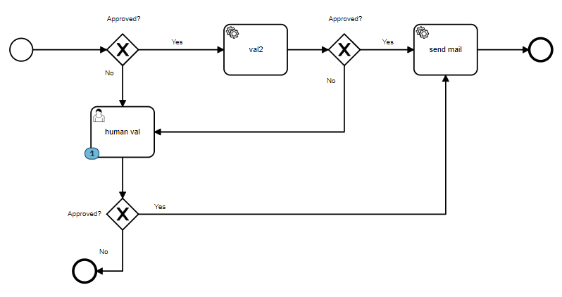

# SI-Exam

We have created a webshop that is taking advantage of many different microservices we have created for this project using both Python, Javascript and Java.
This includes different applications for logging, sending mails, keeping track of inventory, converting currencies, facilitating purchases and bank transfers, as well as a web application consisting of both a front- and a back-end.

Using RabbitMQ as a messagebroker we have each created a bank, all these banks can then talk together over a common trusted source; our RabbitMQ server. We have different queues for the different banks, with different functionalities such as validating a transfer, and sending updates to other banks of transfers.

Every request to our webshop is being logged using another application we have created that is storing information such as form data, and time of request into a Mongo database.

The webshop is displaying prices in USD, but our banking system is relying on EUR, so we have created another microservice. This microservice is web-scraping an old legacy conversion site to get conversion rates, since there is no dedicated API.

Information about orders on the site is emailed to the customer. All emails sent from the webshop are going through our Camunda application to check for errors, such as empty mails, spam, and sensitive GDPR information.

Stock and current items, is handled by a seperate application which only purpose is to make sure prices of products are up to date and the availability of current products is correct.
